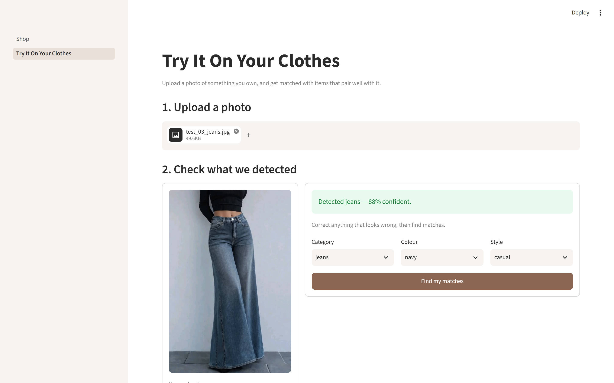
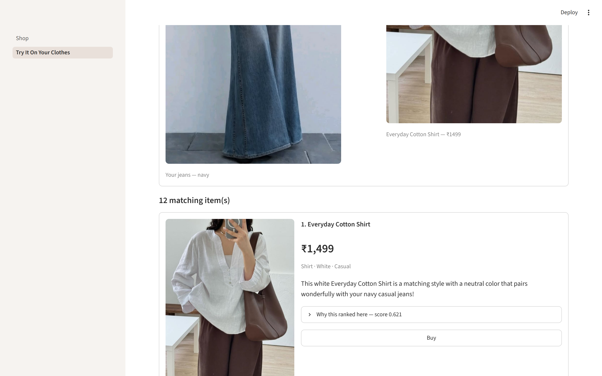
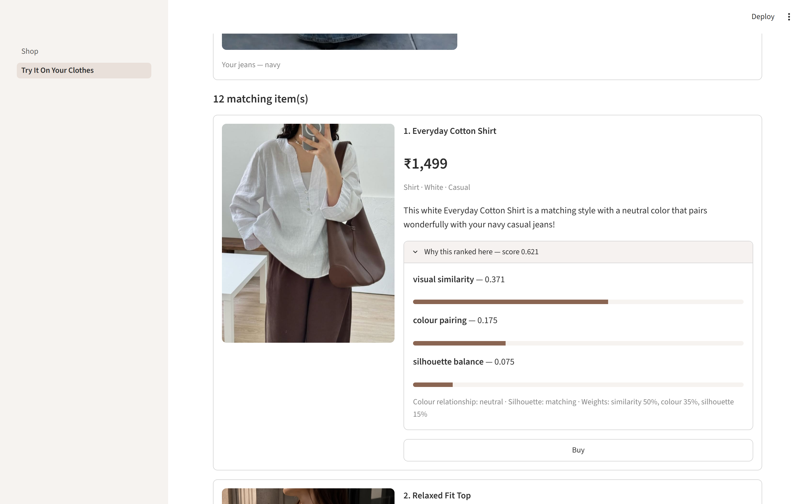
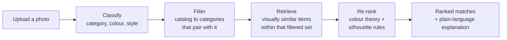
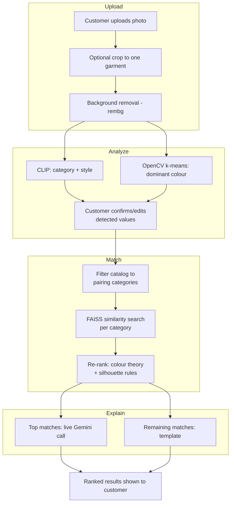

# Outfit-Pairing AI

[](https://github.com/Monicasdesign01/outfit-pairing-ai/actions/workflows/tests.yml)

A concept e-commerce app that pairs a customer's own clothing photo with complementary items from a small catalog — not just visually *similar* items, but items that actually *go with* it, with a plain-language explanation of why.

Built as a portfolio project to learn and demonstrate a real recommendation-system pipeline: classification, embeddings, filtering, similarity retrieval, and rule-based re-ranking, wired up end to end in a working app.

**Live app:** https://outfit-pairing-ai-avl2sgons76apxhjstyfrw.streamlit.app

| Upload and confirm what it found | What it pairs with |
|---|---|
|  |  |

Every ranking is inspectable — the weighted score behind each match is shown rather than hidden:



---

## The core idea

**Items that look similar are not the same as items that go together.**

A plain image-similarity search would just return more shirts that look like the shirt you uploaded. That's not useful — you don't want another shirt, you want something to wear *with* it. So the pipeline is deliberately split into four stages:



1. **Classify** — figure out what the uploaded item actually is (category, dominant colour, style).
2. **Filter** — narrow the catalog to only the categories that pair with that item (a top pairs with bottoms, not other tops).
3. **Retrieve** — within that filtered set, find the items that are visually closest via embedding similarity.
4. **Re-rank** — reorder those candidates using colour-theory and silhouette rules, since "visually closest" and "best pairing" aren't the same thing.

An LLM only writes the *explanation text* for a match that's already been decided — it never picks the match itself, so it can't invent a product that isn't in the catalog.

---

## Features

- **Shop page** — browsable catalog (image, name, price, buy link). Cosmetic only, no cart/checkout.
- **Try It On Your Clothes** — the AI feature:
  - Upload a photo of something you own
  - Crop it down to just the one garment, if the photo shows a full outfit
  - Review the detected category / colour / style, and correct anything the model got wrong — when the classifier's confidence is low, it says so instead of presenting every guess with equal authority
  - Get ranked matches with a plain-language explanation for each
  - **Complete the look** — assembles a whole outfit around your item (a bottom *and* a layer), where each added piece is scored against the pieces already chosen, not just against your upload
  - Open "why this ranked here" on any match to see the weighted score that produced the order
  - Filter results by category
  - Preview any of the matches as a styled outfit pairing card, side by side with your own upload
  - Buy button on every match, via a UPI payment link

---

## Measured results

Most of the interesting engineering in this project is in knowing *how well it actually works*, so accuracy is measured rather than asserted. `evaluate.py` scores the automatic detection against the catalog's own human-assigned labels and prints every individual miss:

```bash
python evaluate.py
```

| Metric | Result | Measured on |
|---|---|---|
| Garment category (CLIP zero-shot) | **67.3%** (33/49) | All 49 catalog items, labels assigned by hand |
| Dominant colour | **44.9%** (22/49) | All 49 catalog items, colours verified by eye |
| Upload latency, warm | **3.2s** (from 14.8s) | Full pipeline, one photo |

Category accuracy is very unevenly distributed, which is more useful to know than the headline number:

| Perfect (100%) | Struggles |
|---|---|
| dress, blazer, jeans, shirt, hoodie, pants | `top` 7/17 (41%), `shorts` 1/3 (33%), `skirt` 5/8 (62%) |

The failure has a clear cause: corsets and camisoles catalogued as `top` are confidently read as `dress`, and flowy shorts as `skirt`. That is a genuine visual ambiguity, not a random error.

**CLIP's confidence score is a usable signal, not decoration** — it averages **78.6%** when the category is right and **64.7%** when it's wrong. The app uses that gap: below 70% it tells the customer it isn't sure and asks them to check.

**Style is deliberately not scored.** The style values in `catalog.json` were produced by the same classifier that would be under test, so scoring them would measure the classifier against itself and return a meaningless 100%.

---

## Tech stack, and why

| Piece | Choice | Why |
|---|---|---|
| Colour detection | OpenCV k-means (k=3) + nearest-neighbour colour naming | Finding the dominant colour is a counting/grouping problem, not something that needs AI |
| Garment classification | CLIP (`openai/clip-vit-base-patch32`), zero-shot | Already learned image-word relationships from the internet — no training data needed |
| Similarity search | FAISS, one index per category | Free, local, fast; category filtering is just which index you query |
| Pairing logic | Hand-written colour-theory + silhouette rules | No dataset of "outfits that go together" exists to train on; rules stay explainable |
| Match explanations | Gemini (`gemini-3.5-flash-lite`), with a template fallback | Phrasing is what an LLM is good at; deciding the match is not — that's the rules engine's job |
| Background removal | `rembg` (u2netp model) | Cleans up product photos before colour/embedding extraction |
| App / UI | Streamlit, multi-page (`st.navigation`) | Whole interface stays in Python — a deliberate scope choice for a solo project |
| Deployment | Streamlit Community Cloud | Free, and a plain `git push` triggers a redeploy |

---

## Engineering decisions

Things that were tried, measured, and then kept or rejected on the evidence — the reasoning matters more than the code.

**Nearest-neighbour colour naming has a real ceiling, so a human closes the gap.** Four techniques were implemented and scored against each other: hand-tuned RGB reference swatches, two different uses of the xkcd colour-survey dataset, and CIE LAB perceptual distance. None of the alternatives beat the hand-tuned version, so the conclusion was that the technique itself — naming a colour from a single dominant RGB value against a small palette — was the limit, not the tuning. Rather than keep optimising a component that isn't the core of the project, the catalog's colours were verified by eye once, and the app now shows the customer an editable dropdown pre-filled with its best guess. A wrong detection became a one-click fix instead of a silent error.

**One CLIP pass instead of three.** Profiling with the pipeline's own timing instrumentation showed the same photo was being encoded three separate times per upload — once for category, once for style, once for the similarity vector — accounting for ~12s of a ~15s upload. Scoring a cached embedding against cached text embeddings instead cut a warm upload to **3.2s**. The two implementations were checked against each other before the old one was removed: identical ranking, probabilities matching to within 0.000001.

**Tests found a real bug in the colour detector.** A test asserting "every reference swatch should name itself" failed: pure mid-grey `(150,150,150)` was being named **beige**, because at zero saturation the hue reading is meaninglessly `0`, which the warm-hue check accepted. The first fix made measured accuracy *worse* (42.9% → 40.8%), so instead of keeping it, the two evaluation runs were diffed item by item — it had fixed one grey top but turned two white shirts grey. Measuring the actual brightness of those photos showed the grey/white boundary had to sit between 0.608 and 0.706; setting it to 0.65 gives **44.9%**, better than either previous version.

**Outfit building is a selection problem, not a second search.** "Complete the look" reuses the candidates the matching engine has already ranked rather than running another retrieval pass, and fills each slot greedily. Exhaustive search over combinations would cost more to explain than it gains at this catalog size. The one addition is a cohesion term — a piece is scored against what's already in the outfit, which is what stops the result being three items that each match the jeans but not each other. A slot with no good candidate is left empty rather than filled badly.

**Garment segmentation was evaluated and rejected.** Isolating a garment from the person wearing it would improve colour accuracy, but the model tested failed on flat-lay photos with no body to anchor to, on unusual poses, and on non-standard silhouettes. Plain background removal is used instead, and the imprecision is accounted for rather than hidden.

**A 3D mannequin preview was built, then removed.** The goal was to show the outfit worn. Reaching the quality bar that made it worth showing turned out to require cloth-simulation software and 3D garment models, which flat product photos cannot provide — so the 3D attempt was deleted rather than kept as something half-working, and replaced with a 2D pairing card that uses the real photos.

---

## Planned improvements

- **Lift `top` and `shorts` category accuracy**, now that evaluation has pinpointed exactly where the classifier struggles: corsets and camisoles read as `dress`, flowy shorts read as `skirt`. Six of the ten categories already score 100%, so the work is targeted rather than general — the next step is prompt wording that describes the visual distinction (straps and a cropped hem vs. a full-length garment), the same approach that previously lifted overall accuracy from 67.6% to 79.4% on the smaller catalog.
- **Move colour naming beyond nearest-neighbour matching**, which four measured experiments established as the limiting factor. The next iteration is a learned colour classifier trained on real fabric photos rather than distance to a small palette.
- **Score style properly** by building a small independently-labelled set, so it can be measured instead of left unscored.
- **Expand the catalog** beyond the current placeholder names/prices with a larger, real product set.
- **Swap in a real UPI ID** for the "Buy" link once the store is live — the payment-link code itself is already complete.
- **Optimize memory usage** on the free deployment tier (~725MB measured against a 1GB limit on a single minimal upload) — candidates already identified: a smaller CLIP variant, and making background removal optional/toggleable.

---

## Architecture in more detail



---

## Running it locally

```bash
git clone <this-repo>
cd outfit-pairing-ai
python -m venv venv
venv\Scripts\activate.bat        # Windows
pip install -r requirements.txt
```

Set a Gemini API key (optional — the app falls back to template explanations without one):

```
setx GEMINI_API_KEY "your-key-here"
```

Then build the catalog embeddings once, and run the app:

```bash
python build_catalog_embeddings.py
streamlit run app.py
```

Run the tests and reproduce the accuracy numbers:

```bash
pip install -r requirements-dev.txt
pytest tests/ -q     # 54 tests, no model download needed
python evaluate.py   # prints the accuracy table above, plus every miss
```

---

## Project structure

```
app.py                       # Entry point — Streamlit multi-page navigation
app_pages/
  try_it_on.py                # The AI feature: upload, crop, detect, match, explain
  shop.py                      # Browsable catalog page
evaluate.py                   # Scores detection accuracy against human-assigned labels
tests/                        # 54 pytest tests over the pure logic (no model download)
scripts/                      # Manual end-to-end smoke checks
.github/workflows/tests.yml   # CI: installs the real requirements.txt on Linux, runs tests
matching_engine.py            # classify -> filter -> retrieve -> re-rank pipeline
outfit_builder.py             # Assembles a full outfit from the ranked candidates
pairing_rules.py              # Category pairing rules, colour/silhouette scoring, weights
color_detector.py             # k-means dominant colour + colour naming
classify_garment.py           # CLIP zero-shot category/style classification
remove_background.py          # rembg background removal
explanation.py                # Gemini call + template fallback for match text
build_catalog_embeddings.py   # One-time script: builds catalog.json's embeddings/colour/style
shop_utils.py                 # Catalog image paths, UPI payment link builder
catalog.json                  # Catalog item metadata (name, price, colour, category, style)
catalog_embeddings.npz        # Precomputed CLIP embeddings for the catalog
catalog_images/               # Catalog product photos
```
