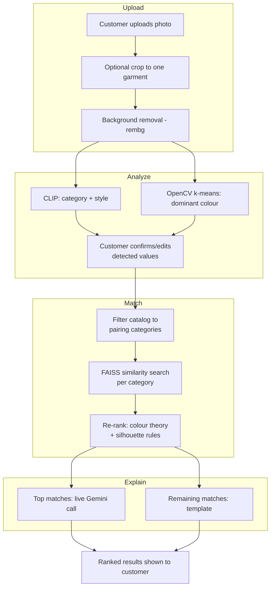

# Outfit-Pairing AI

A concept e-commerce app that pairs a customer's own clothing photo with complementary items from a small catalog — not just visually *similar* items, but items that actually *go with* it, with a plain-language explanation of why.

Built as a portfolio project to learn and demonstrate a real recommendation-system pipeline: classification, embeddings, filtering, similarity retrieval, and rule-based re-ranking, wired up end to end in a working app.

**Live app:** https://outfit-pairing-ai-avl2sgons76apxhjstyfrw.streamlit.app

---

## The core idea

**Items that look similar are not the same as items that go together.**

A plain image-similarity search would just return more shirts that look like the shirt you uploaded. That's not useful — you don't want another shirt, you want something to wear *with* it. So the pipeline is deliberately split into four stages:


1. **Classify** — figure out what the uploaded item actually is (category, dominant colour, style).
2. **Filter** — narrow the catalog to only the categories that pair with that item (a top pairs with bottoms, not other tops).
3. **Retrieve** — within that filtered set, find the items that are visually closest via embedding similarity.
4. **Re-rank** — reorder those candidates using colour-theory and silhouette rules, since "visually closest" and "best pairing" aren't the same thing.

An LLM only writes the *explanation text* for a match that's already been decided — it never picks the match itself, so it can't invent a product that isn't in the catalog.

---

## Features

- **Shop page** — browsable catalog (image, name, price, buy link). Cosmetic only, no cart/checkout.
- **Try It On Your Clothes** — the AI feature:
  - Upload a photo of something you own
  - Crop it down to just the one garment, if the photo shows a full outfit
  - Review the detected category / colour / style, and correct anything the model got wrong
  - Get ranked matches with a plain-language explanation for each
  - Filter results by category
  - Buy button on every match, via a UPI payment link

---

## Tech stack, and why

| Piece | Choice | Why |
|---|---|---|
| Colour detection | OpenCV k-means (k=3) + nearest-neighbour colour naming | Finding the dominant colour is a counting/grouping problem, not something that needs AI |
| Garment classification | CLIP (`openai/clip-vit-base-patch32`), zero-shot | Already learned image-word relationships from the internet — no training data needed |
| Similarity search | FAISS, one index per category | Free, local, fast; category filtering is just which index you query |
| Pairing logic | Hand-written colour-theory + silhouette rules | No dataset of "outfits that go together" exists to train on; rules stay explainable |
| Match explanations | Gemini (`gemini-3.5-flash-lite`), with a template fallback | Phrasing is what an LLM is good at; deciding the match is not — that's the rules engine's job |
| Background removal | `rembg` (u2netp model) | Cleans up product photos before colour/embedding extraction |
| App / UI | Streamlit, multi-page (`st.navigation`) | Whole interface stays in Python — a deliberate scope choice for a solo project |
| Deployment | Streamlit Community Cloud | Free, and a plain `git push` triggers a redeploy |

---

## Known limitations (stated honestly)

- **Automatic colour detection has a real, measured ceiling of roughly 55–65% accuracy.** This isn't a guess — four different techniques were tried and measured (hand-tuned RGB nearest-neighbour, two different uses of the xkcd colour-survey dataset, and CIE LAB perceptual distance), and none beat the ~60% mark. Nearest-neighbour colour naming from a single dominant RGB value is a genuinely hard problem — real-world fabric colours are muted, lit unevenly, and don't sit cleanly next to a small set of reference swatches.
  - **The actual fix wasn't more algorithm tuning — it was giving up on "the algorithm must be right" and adding a human in the loop instead.** The catalog's colours are now 100% correct because they were manually verified by eye once, and the app itself shows the customer an editable colour/category/style dropdown pre-filled with its best guess, so a wrong detection is a one-click fix rather than a silent error.
- **CLIP garment classification is measurably imperfect too** (accuracy improved from 67.6% to 79.4% through prompt-wording tuning alone), and style detection is weaker than category detection.
- **The catalog is small and uses placeholder names/prices** — this is a concept project, not a real store.
- **The "Buy" link uses a placeholder UPI ID** until it's swapped for a real one — the payment-link code itself is complete.
- **Memory usage on the free deployment tier is tight** (~725MB measured against a 1GB limit on a single minimal upload) — a known, documented risk rather than a hidden one.

---

## Architecture in more detail



---

## Running it locally

```bash
git clone <this-repo>
cd outfit-pairing-ai
python -m venv venv
venv\Scripts\activate.bat        # Windows
pip install -r requirements.txt
```

Set a Gemini API key (optional — the app falls back to template explanations without one):

```
setx GEMINI_API_KEY "your-key-here"
```

Then build the catalog embeddings once, and run the app:

```bash
python build_catalog_embeddings.py
streamlit run app.py
```

---

## Project structure

```
app.py                       # Entry point — Streamlit multi-page navigation
app_pages/
  try_it_on.py                # The AI feature: upload, crop, detect, match, explain
  shop.py                      # Browsable catalog page
matching_engine.py            # classify -> filter -> retrieve -> re-rank pipeline
pairing_rules.py              # Category pairing rules, colour/silhouette scoring
color_detector.py             # k-means dominant colour + colour naming
classify_garment.py           # CLIP zero-shot category/style classification
remove_background.py          # rembg background removal
explanation.py                # Gemini call + template fallback for match text
build_catalog_embeddings.py   # One-time script: builds catalog.json's embeddings/colour/style
shop_utils.py                 # Catalog image paths, UPI payment link builder
catalog.json                  # Catalog item metadata (name, price, colour, category, style)
catalog_embeddings.npz        # Precomputed CLIP embeddings for the catalog
catalog_images/               # Catalog product photos
```
